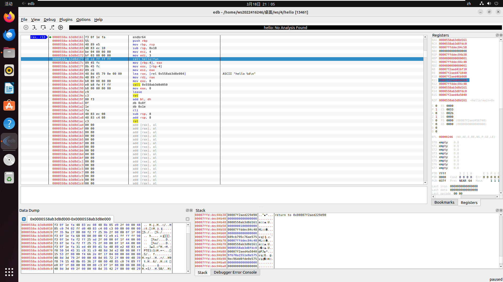
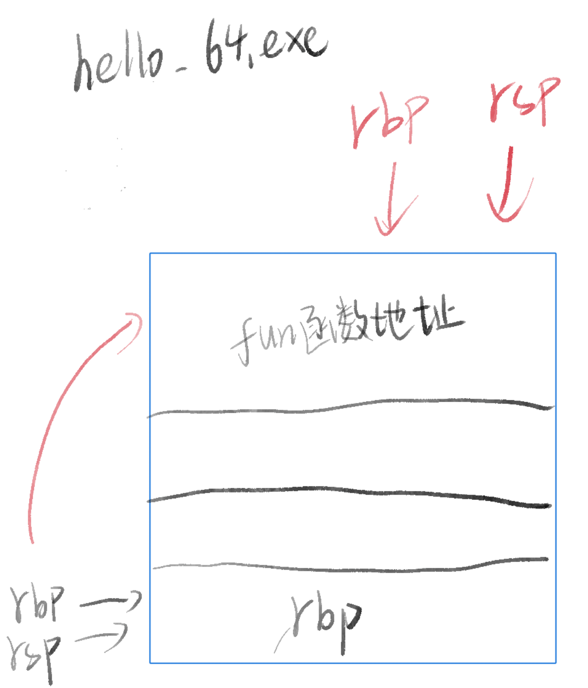

# 汇编语言与逆向工程实验报告 4

> 实验目的：call，ret 堆栈，栈帧图

## hello_64.exe

### 汇编

### fun 函数栈帧

> 函数栈帧详解https://blog.csdn.net/qq_41412237/article/details/119489211#/

1. `endbr64`: 可能是一个保留指令，用于指示 64 位代码段的开头。

2. `push rbp`: 将当前栈底指针 `rbp` 的值压入栈中，准备建立栈帧。

3. `mov rbp, rsp`: 设置栈底指针 `rbp` 的值为当前栈顶指针 `rsp` 的值，建立栈帧。

4. `sub rsp, 0x10`: 分配 16 字节的空间给局部变量。

5. `mov esi, 4`: 将立即数 4 移入寄存器 esi 中。

6. `mov edi, 3`: 将立即数 3 移入寄存器 edi 中。

7. `call hello_fun`: 调用名为 hello_fun 的函数。

8. `mov [rbp-4], eax`: 将函数返回值保存到栈帧中的位置。

9. `mov eax, [rbp-4]`: 将之前保存在栈帧中的函数返回值移入 eax 寄存器。

10. `mov esi, eax`: 将 eax 寄存器中的值移入 esi 寄存器。

11. `lea rax, [rel 0x6361e9cc0004]`: 将相对地址 0x6361e9cc0004 加载到 rax 寄存器中。

12. `mov rdi, rax`: 将 rax 中的值移入 rdi 寄存器。

13. `mov eax, 0`: 将 0 移入 eax 寄存器。

14. `call 0x6361e9cbf050`: 调用地址 0x6361e9cbf050 处的函数。

15. `mov eax, 0`: 将 0 移入 eax 寄存器。

16. `leave`: 恢复栈帧。

17. `ret`: 返回。

## hello_32.exe

### 汇编

### fun 函数栈帧

根据提供的汇编代码，下面是对 `fun` 函数栈帧的分析：

1. `push ebp`: 将旧的基址指针（ebp）压入栈中，保存调用函数前的堆栈帧。

2. `mov ebp, esp`: 设置新的基址指针，将栈顶指针（esp）的值赋给 ebp，建立新的堆栈帧。

3. `sub esp, 0x10`: 为局部变量分配空间，预留 16 字节的空间。这些空间将用于存储局部变量。

4. 在调用 `hello32!fun` 函数之前，我们没有看到其他的局部变量分配操作。因此，该函数可能只有少量的局部变量，而这些局部变量可以在前面的 `sub esp, 0x10` 中分配的空间内。

5. `call hello32!fun`: 调用了名为 `hello32!fun` 的函数，这是对应 `fun` 函数的调用。

6. `add esp, 8`: 调整栈指针，释放之前压入栈中的两个参数，这表明函数调用时传递了两个参数。

7. `mov [ebp-0xc], eax`: 将 `eax` 寄存器中的值存储到基址指针（ebp）偏移 `-0xc` 处。这可能是 `fun` 函数的返回值（eax）被存储的位置。

8. `sub esp, 8`: 为新的参数和调用准备空间。通常，这种指令用于为函数调用的参数分配空间。

9. `push dword [ebp-0xc]`: 将基址指针（ebp）偏移 `-0xc` 处的值压入栈中，这很可能是为了将 `fun` 函数的返回值作为参数传递给后续的函数调用。

---

