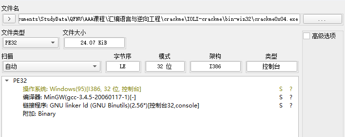
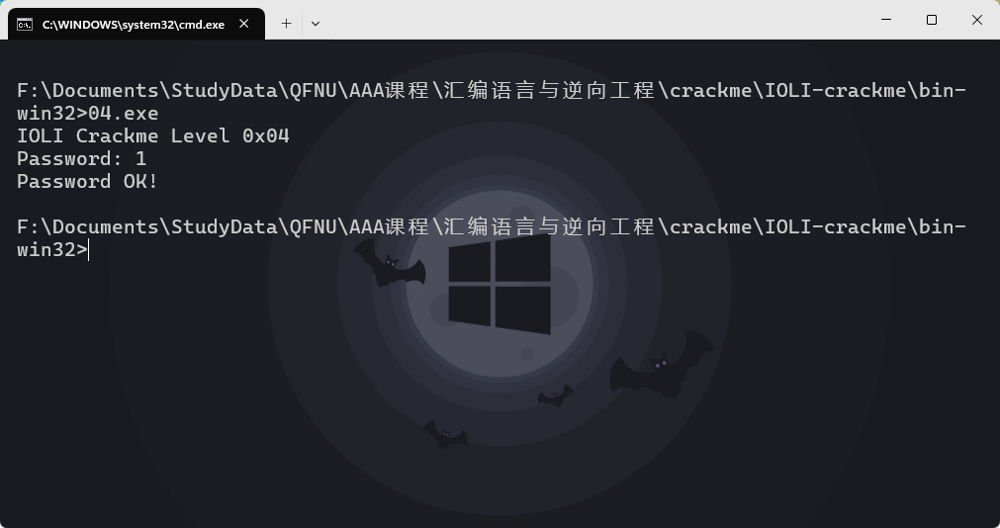

# 汇编语言与逆向工程实验报告 7

## 文件信息

首先看一下文件信息



可以看到是 32 位程序

## 静态分析

定位到关键函数

```c
int __cdecl check(char *Str)
{
  char Buffer; // [esp+1Bh] [ebp-Dh] BYREF
  size_t i; // [esp+1Ch] [ebp-Ch]
  int v4; // [esp+20h] [ebp-8h]
  int v5; // [esp+24h] [ebp-4h] BYREF

  v4 = 0;
  for ( i = 0; i < strlen(Str); ++i )
  {
    Buffer = Str[i];
    sscanf(&Buffer, "%d", &v5);
    v4 += v5;
    if ( v4 == 15 )
    {
      printf("Password OK!\n");
      exit(0);
    }
  }
  return printf("Password Incorrect!\n");
}
```

可以看到函数 `check` 接收一个字符串 `Str` 作为参数，然后循环遍历字符串，将每个字符转换为整数，并累加到变量 `v4` 中。如果 `v4` 等于 15，则打印 `Password OK!` 并退出程序，否则打印 `Password Incorrect!` 并返回。

## 动态调试

找到 password ok 字符串


函数改成 jne 改成 je，意思就是把原来的输出错误的条件改成输出正确的条件，这样就会一直输出 OK


打补丁导出



实现任意输入都输出 password ok

> 相关链接
>
> [[原创]x64dbg 使用记录：开始调试并修改一个程序](https://bbs.kanxue.com/thread-275779.htm#msg_header_h2_0)
>
> [x64dbg 入门系列（二）-搜索字符串](https://zhuanlan.zhihu.com/p/146616644#/)
>
> [[x64dbg] 实战 01 - 参数打印/修改参数内容（条件断点、命令、脚本）](https://blog.csdn.net/kinghzking/article/details/122476471#/)
>
> [x32dbg/x64dbg 修改后如何保存到 exe](https://blog.csdn.net/qq_44275213/article/details/107835055#/)
>
> [x86 汇编*JE、JNE、JCXZ 和 JECXZ 指令*笔记\_34](https://blog.csdn.net/qq_16774199/article/details/124509624#/)
