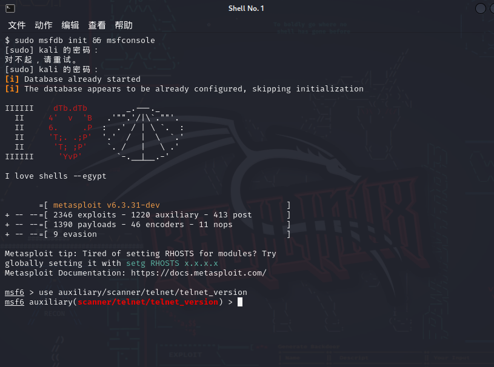
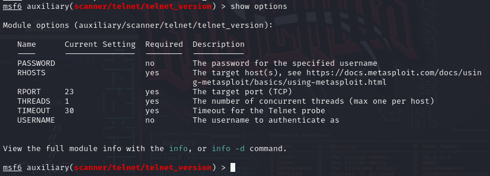
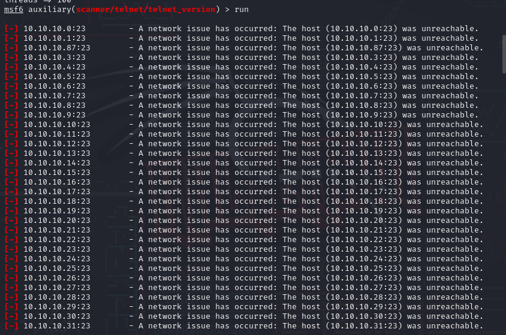
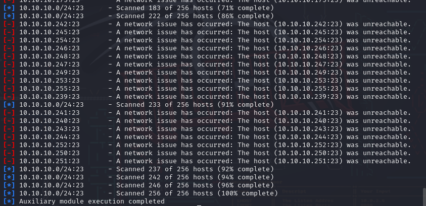
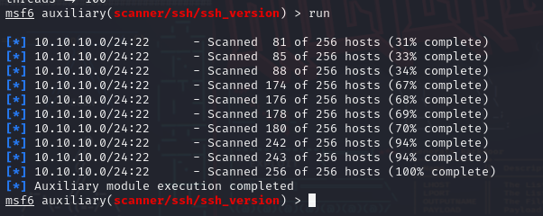
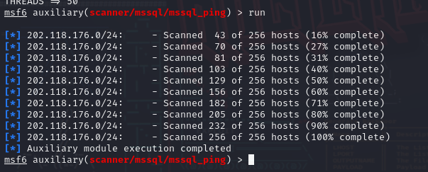
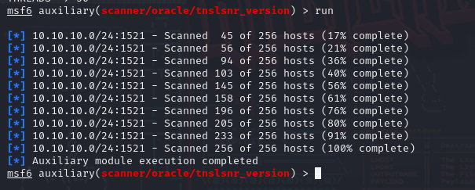

> 老师发了个 ppt 复现一下，顺便发在博客上了

# 网络服务扫描实验

## 前期准备

Metasploit 工具                        1 套

PC 机（win10）                        1 台

## 预习要求

做好实验预习，复习网络服务有关内容。

熟悉实验过程和基本操作流程。

做好预习报告。

## 实验任务

扫描当前机器的网络服务

## 实验环境

一台安装了 Metasploit 的计算机。

## 预备知识

1.Telnet 服务相关知识

2.SSH 服务相关知识

3.数据库相关知识

## 实验步骤

### 1.Telnet_version 模块

#### （1）使用 use 命令使用 telnet_version 模块。

 msf > use auxiliary/scanner/telnet/telnet_version

#### （2）通过 show 命令查看模块的设置选项。

 msf auxiliary(telnet_version) > show options

> 其中 Name 表示的是需要设置的选项的名称，Current 表示的是该选项目前默认的设置值，Setting 表示是否进行了设置，Required 则表示的是该选项是否必须设置，yes 表示必须进行设置，而 no 则表示可以设置也可以不进行设置。Description 则表示的是对选项的介绍。最重要的选项是 RHOSTS，即目标地址范围或 CIDR 标识符。也就是要扫描的地址范围设置。

#### （3）使用 set 命令设置目标地址范围。

 msf auxiliary(telnet_version) > set rhosts 10.10.10.0/24

设置后的界面显示如下所示：

#### （4）使用 set 命令设置并发线程的数量。

 msf auxiliary(telnet_version) > set threads 100

设置后的界面显示如下所示：

#### （5）使用 run 命令来执行扫描。

 msf auxiliary(telnet_version) > run

### 2.SSH_version 模块

#### （1）使用 use 命令使用 ssh_version 模块。

 msf > use auxiliary/scanner/ssh/ssh_version

#### （2）通过 show 命令查看模块的设置选项。

> 同 telnet_version 模块相同，ssh_version 扫描模块的设置选项也包括 Name、Current、Setting、Required 和 Description 五部分，所表示的含义也相同。

#### （3）使用 set 命令设置目标地址范围。

 msf auxiliary(ssh_version) > set rhosts 10.10.10.0/24

#### （4）使用 set 命令设置并发线程的数量。

 msf auxiliary(ssh_version) > set threads 100

#### （5）使用 run 命令来执行扫描。

 msf auxiliary(ssh_version) > run

### 3.SSH_login 模块

#### （1）使用 use 命令使用 ssh_login 模块。

 msf > use auxiliary/scanner/ssh/ssh_login

#### （2）通过 show 命令查看模块的设置选项。

 msf auxiliary(ssh_login) > show options

> 与前面相比，ssh_login 模块用到的设置项多了很多。下面进行简单的介绍：
>
> BLANK_PASSWORDS，也就是空白密码的意思，即前面讲到的会先默认对空白密码进行验证。
>
> BRUTEFORCE_SPEED，暴力破解的速度，从 0 到 5 可选。
>
> PASSWORD，即准备暴力破解使用的密码，虽然不是必须的，但是没有进行暴力破解的密码，模块在验证完空密码后就停止了，因此这个其实是必须设置的。
>
> PASS_FILE，即准备暴力破解使用的密码文件，PASSWORD 是指定单个的密码，而 PASS_FILE 则是将密码字典放到一个文件里，并且每行只能放置一个密码。
>
> STOP_ON_SUCCESS，即如果得到主机正在工作的消息，则停止试探密码，一般是设为 false 的。
>
> USERNAME，同 PASSWORD 一样，虽然要求不是必须，但是在实际使用中是需要指定的。
>
> USERPASS_FILE，是同时存储了密码和用户名的口令字典文件。每行包括一个用户名和对应的一个密码，中间用一个空格分隔开。
>
> USER_AS_PASS，将所用用户名作为它的密码进行猜测。这在实际使用中很有用，因为经常有些安全意识薄弱的管理员这样设置密码。
>
> USER_FILE，存储试探用户名的文件，同样每行一个用户名。
>
> VERBOSE，是否在窗口输出所有的尝试情况，默认是输出的。

在口令猜测时明显需要设置的项或者说可以设置的项变的多了很多，这就需要根据实际情况来进行设置。下面，写一个简单的例子：

根据上次实验的结果，选取 10.10.10.254

#### （3）使用 set 命令设置目标地址范围。

 msf auxiliary(ssh_login) > set rhosts 10.10.10.254

#### （4）使用 set 命令设置参数 username 的值。

在这里仅尝试用户名为 root 的情况，因此代码如下：

 msf auxiliary(ssh_login) > set username root

#### （5）使用 set 命令设置参数 pass_file 的值。

将名称为 words.txt 的密码字典放在了桌面，因此代码如下：

 msf auxiliary(ssh_login) > set pass_file /root/Desktop/words.txt

#### （6）使用 set 命令设置并发线程的数量。

 msf auxiliary(ssh_login) > set threads 100

#### （7）使用 run 命令来执行扫描。

 msf auxiliary(ssh_login) > run

### 4.Mssql_ping 模块

#### （1）使用 use 命令使用 mssql_ping 模块。

 msf > use auxiliary/scanner/mssql/mssql_ping 

#### （2）通过 show 命令查看模块的设置选项。

 msf auxiliary(mssql_ping) > show options

> 与前面不同的是在 mssql_ping 模块用到了 USERNAME 设置项，这起始与 Microsoft SQL Server 安装时候的一个默认设置有关。在初次安装服务器的时候，会默认创建 sa 或系统管理员用户。因此，这里 USERNAME 设置项的默认设置是 sa，在这里也不准备进行更改。

#### （3）使用 set 命令设置目标地址范围。

 msf auxiliary(mssql_ping) > set RHOSTS 202.118.176.0/24

#### （4）使用 set 命令设置并发线程的数量。

 msf auxiliary(mssql_ping) > set THREADS 50

#### （5）使用 run 命令来执行扫描。

 msf auxiliary(mssql_ping) > run

### 5.Tnslsnr_version 模块

#### （1）使用 use 命令使用 tnslsnr_version 模块。

 msf > use auxiliary/scanner/oracle/tnslsnr_version 

#### （2）通过 show 命令查看模块的设置选项。

 msf auxiliary(tnslsnr_version) > show options

#### （3）使用 set 命令设置目标地址范围。

 msf auxiliary(tnslsnr_version)> set RHOSTS 10.10.10.0/24

#### （4）使用 set 命令设置并发线程的数量。

 msf auxiliary(tnslsnr_version) > set THREADS 50

#### （5）使用 run 命令来执行扫描。

 msf auxiliary(tnslsnr_version) > run

